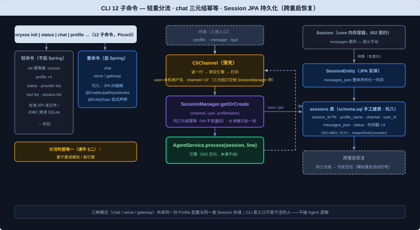

# CLI 模块设计文档

> 需求编号：003-cli | 对应主体阶段 US-2 延伸（课件第 18 节：CLI + Session 持久化）
> 文档依据：`docs/TechnicalSolution.md` §8.1/§8.4/§8.6/§8.7/§9.2/§10、`docs/DemandAnalysis.md` §5.1/§5.9/§5.10/§5.11/§13、`docs/AiProgrammingGuide.md` §4.2（权威设计源）；课件《第 18 节：CLI 功能概述、实现思路与代码讲解》（course repo `D:\code\oryxos\docs\class\`，实施级事实源）
>
> 修订说明（2026-09-02）：本版对齐课件第 18 节——① 范围收窄至课件"本节交付物"（OryxOsCli 12 子命令 + CliChannel + sessions 表 + SessionManager 换 JPA 实现；serve/gateway 的 Web 本体归第 26 节及后续）；② 课件与四文档的差异点经用户拍板（2026-09-02）：课件"profile list 读 .oryxos/profiles/ 目录"与宪法 IV/技术方案 §8.2 冲突 → **按宪法 IV 取 agents/ 目录**（沿用 002 拍板先例）；需求文档 §5.10 的 chat `--message` 单条模式课件未覆盖 → 按四文档补上；10 项「为实现级明确」决策（--message/user 标识/默认 Profile/delete 行为/四个查询命令实现方式/serve-gateway 占位/装配类命名/init 目录树）用户全部接受；③ 前序衔接：002 已交付 Session/SessionManager 内存版并立跨节契约"第 18 节 JPA 化、契约不变、只换实现"——本课正是那个换实现。

## 背景与价值

一句话：**有了 Provider（会调模型）和 ReAct（会思考的循环），OryxOS 的"大脑"已经能转了，但还缺一个能亲手操作它的入口**（课件 §一）。CLI 是 Provider、ReAct 之后第一个"看得见摸得着"的东西——到这一步，你能在终端里真正跟自己搭的 Agent 说上话（课件 §五）。

CLI 在架构里的角色很清楚：**它是消息进出的门，不是干活的人**。干活的是引擎和下面三块能力（课件 §一）；OryxOS 有两个"人推"入口——CLI 管本地交互和调试，Web Service 管业务系统通过 REST API 集成（技术方案 §2、课件 §一）。CLI 的一个 `chat` 命令活就三步：读用户输入 → 交给 `AgentService.process` → 把结果打印出来——它自己不想、不调模型、不执行工具（课件 §二）。

三个运行模式（chat / serve / gateway）的区别只在"消息从哪进来"：chat 走终端、serve 走 HTTP、gateway 挂多个通道；**三种模式共享同一份 Profile 配置和同一套 Session 存储，底下的引擎是同一个**（需求文档 §5.10、技术方案 §8.6、课件 §一）。

Session 持久化随本节一并交付：CLI 是第一个真正"用起来" Session 的入口（课件 §三），会话落 SQLite 后**跨重启恢复**（需求文档 §5.9、§13 验收点"Session 持久化"）；Session 是后面所有入口共用的地基，口径问题最难查，所以这节就把会话层钉死（课件 §四）。

动手前定死的四件事（课件 §二）：① CLI 只做入口不碰 Agent 逻辑；② **命令按轻重分流**——要调模型/跑引擎的重命令（chat/serve/gateway）才启动 Spring 上下文，其余轻命令直接文件操作秒回（Spring Boot 启动 2~4 秒，等不起）；③ 参数解析交给 Picocli，不自己撸 `args[]`；④ **重命令启动 Spring 时模块扫描范围要显式声明**——`scanBasePackages` 只管组件扫描，**不会**带动 JPA 的 `@EnableJpaRepositories`/`@EntityScan` 扫到别的模块，不声明会得到 "Found 0 JPA repository interfaces"、审计写不进去直接报错（课件 §二第四点，**坑九**；本坑 002 人工验收已在 `OryxOsApplication` 上实机踩过并修复，本课重命令启动类沿用该结论并有回归测试钉死）。

## 用户场景

**场景一（本节验收场景）：终端里 init 后和天气 Agent 完整对话，重启后历史还在**
用户在一个空目录里 `oryxos init` 初始化工作区 → `oryxos profile create weather` 生成天气 Agent → 编辑其 `AGENT.md` 配置 provider/身份 → `oryxos chat --profile weather` 进入交互，输入"查一下北京天气并告诉我穿什么"，Agent 经 ReAct 循环调工具、给穿搭建议；`/quit` 退出后再次 `oryxos chat` 进入，同一会话的历史还在。这就是 Demo 一对话版的完整体验（编程指南 §4.2、课件 §五）。

**场景二：多 Agent 并存、按名切换互不串台**
工作区里注册了 weather 和 ops 两个 Agent：`oryxos profile list` 列出两者，`oryxos chat --profile ops` 与运维助手对话——两个 Agent 的 Session 互不相认、各记各的历史（需求文档 §5.11、技术方案 §8.2"多 Agent 并存是 OS 的最小体现"）。

**场景三：查询类命令秒回**
`oryxos profile list` / `oryxos status` / `oryxos provider list` 这类"看一眼就退"的命令不启动 Spring 上下文，秒级返回（课件 §二）。

**场景四：昨天聊到一半，今天接着聊**
用户昨天在 CLI 里和 Agent 的对话存入 SQLite；今天重启程序再次进入，同一 (channel, user, profile) 三元组命中同一条 Session，历史完整恢复，接着聊（需求文档 §5.9"重启 OryxOS 后正在进行的 Session 可以恢复"、课件 §四"模拟重启"测试点）。

## 功能需求

> 从课件一、二、三部分提炼：编程指南 §4.2（CLI Channel 类 task 大类）、技术方案 §8.1/§8.4/§8.6/§8.7/§9.2、需求文档 §5.1/§5.9/§5.10/§5.11。**交付物列是本节对外概念的白名单**，清单之外的新增对外概念必须停下报告。

| 编号 | 需求 | 交付物（落位模块） | 来源 |
|------|------|-------------------|------|
| FR-1 | **`OryxOsCli` 主入口挂 12 个子命令**：`init` / `status` / `chat` / `serve` / `gateway` / `profile list|create|show|delete` / `provider list` / `tool list` / `session list`，每个子命令一个 `@Command` 类，参数解析全部交给 Picocli（帮助/报错自带）。地基已有的 `OryxOsCli` 类（subcommands 空壳）挂接 | `OryxOsCli` + 12 个 `@Command` 子命令类（oryxos-cli） | 课件 §三；技术方案 §8.7；需求文档 §5.11 |
| FR-2 | **命令按轻重分流（约定）**：重命令（`chat`/`serve`/`gateway`，要调模型/跑引擎）才启动 Spring 上下文；轻命令（`init`/`profile` 四命令/`status`/`provider list`/`tool list`/`session list`）直接用标准 API 读写文件或 JDBC 直读 SQLite，**不启动 Spring**，秒回。判断标准唯一：这个命令要不要调模型/跑引擎（课件 §二） | 12 个子命令实现（oryxos-cli） | 课件 §二；技术方案 §8.7"不需要 Spring 上下文的命令直接走文件操作" |
| FR-3 | **坑九（JPA 扫描根）**：重命令启动 Spring 的启动类/装配配置必须显式声明 `@EnableJpaRepositories(basePackages = "com.oryxos.storage")` 与 `@EntityScan(basePackages = "com.oryxos.storage")`——`scanBasePackages` 与 JPA 扫描是两套独立逻辑，不显式声明会 "Found 0 JPA repository interfaces"、审计写不进去直接报错（002 已在 `OryxOsApplication` 实机踩过并修复；本课回归测试钉死） | 重命令启动类（oryxos-cli） | 课件 §二第四点；002 人工验收实机记录 |
| FR-4 | **`chat` 命令 + `CliChannel`（薄壳）**：读 stdin、写 stdout，维护当前 Session，每行输入交 `AgentService.process(session, line)`，`/quit` 退出——通篇没有任何"Agent 智能"，读—转交—打印。`--profile` 选项默认 `"default"`；**`--message "xxx"` 发单条消息后退出**（需求文档 §5.10 明确，课件未覆盖——为实现级明确）；user 取本机用户名（`System.getProperty("user.name")`——为实现级明确）；channel 固定传 `"cli"`。**session_id 的三元组只由 SessionManager 一处拼接**，CLI 只提供三元组、不自己拼字符串（课件 §三） | `ChatCommand`（oryxos-cli）+ `CliChannel`（oryxos-channel-cli，交互循环实体） | 课件 §三骨架；技术方案 §8.4/§10；需求文档 §5.10 |
| FR-5 | **`init` 命令（幂等）**：创建 `.oryxos/` 工作区完整结构（`agents/`、`skills/`、`memory/`（含 MEMORY.md 模板）、`sessions/`、`logs/`、`mcp_servers.yaml`、Bootstrap 三件套 `AGENTS.md`/`SOUL.md`/`USER.md`），已存在的一律不覆盖；`oryxos.db` 不预建文件（SQLite 首连自动创建）。技术方案 §8.1 与需求文档 §5.1 目录树有差异（§8.1 多 mcp_servers.yaml、少 output/）——按"技术方案 > 需求文档"取舍取 §8.1；`init` 同时生成默认 Profile（技术方案 §8.1"生成默认 Profile"——为实现级明确：在 `agents/default/` 生成 AGENT.md 模板） | `InitCommand`（oryxos-cli） | 技术方案 §8.1；需求文档 §5.1；课件 §五 |
| FR-6 | **`profile` 四个命令**：`list` 扫 `.oryxos/agents/` 子目录列名（**课件示例读 `.oryxos/profiles/` 目录，与宪法 IV"一个目录 = 一个 Agent"及技术方案 §8.2 冲突——按 002 拍板先例取宪法 IV：agents/ 目录**，待用户复核）；`create <name>` 生成 `agents/<name>/AGENT.md` 模板目录（需求文档 §5.1"用 profile create 生成第一个 Agent 目录"）；`show <name>` 展示该 Agent 的 frontmatter 概要；`delete <name>` 删除 Agent 目录（行为为实现级明确：直接删目录，输出被删路径） | `ProfileListCommand`/`ProfileCreateCommand`/`ProfileShowCommand`/`ProfileDeleteCommand`（oryxos-cli） | 课件 §三示例；需求文档 §5.1/§5.11；技术方案 §8.2；宪法 IV |
| FR-7 | **`status` / `provider list` / `tool list` / `session list` 四个查询命令**（轻命令）：`status` 汇总工作区与配置状态；`provider list` 读全局层 `oryxos.providers` 配置列出已配置 Provider（轻命令直接读 application.yaml——为实现级明确）；`tool list` 列出已注册工具——ToolRegistry 归第 20 节，本课输出"内置工具尚未就位（第 20 节）"占位提示（为实现级明确）；`session list` JDBC 直读 `sessions` 表列出会话概要（session_id/profile/channel/状态/最后活跃时间） | `StatusCommand`/`ProviderListCommand`/`ToolListCommand`/`SessionListCommand`（oryxos-cli） | 课件 §三"各自一个 @Command 类"；需求文档 §5.11；CLAUDE.md 命令行表 |
| FR-8 | **`Session` JPA 实体 + `SessionRepository` + `sessions` 表（手工建表脚本增量）**：字段照技术方案 §9.2——`session_id`（VARCHAR PK）、`profile_name`、`channel`、`user_id`、`messages_json`（TEXT，对话历史**整体 JSON 序列化一列存**，核心阶段不做按条拆表——课件 §三）、`status`（active/archived）、`created_at`/`last_active_at`/`archived_at`（ISO-8601 TEXT，沿用 001 `InstantTextConverter`）。建表走 `schema.sql` 手工脚本增量追加（**坑八口径延续**：SQLite 不依赖 `ddl-auto=update`，测试执行同一份脚本） | `SessionEntity` 实体、`SessionRepository`、schema.sql 增量（oryxos-storage） | 课件 §三；技术方案 §9.2；002 坑八口径 |
| FR-9 | **`SessionManager` 换 JPA 实现（契约不变、只换实现）**：`getOrCreate(channel, user, profileName)` = 查库 → 命中则反序列化 `messages_json` 重建 Session；未命中则新建并落库。`get(sessionId)` = 查库重建。`save(session)` = 序列化 messages 落库 + 更新 `last_active_at`。**session_id 拼接仍只在本类一处**（H4 不变量四）；core 的 `Session` 数据类不动（002 已交付，消息容器语义保留），持久化行由 storage 的 `SessionEntity` 承担，两者转换在本类内完成。002 跨节契约明确"第 18 节 JPA 化、契约不变、只换实现"——本课按契约执行，不改 `getOrCreate`/`get`/`save` 签名 | `SessionManager`（oryxos-core，实现改造；签名不变）+ 依赖 `SessionRepository`（oryxos-storage） | 课件 §三；002 contracts/session-manager.md 行为不变量；技术方案 §9.2 |
| FR-10 | **重命令 Spring 装配**：新增装配配置类把 002 组件接成 Spring beans——`ProfileRegistry`（启动扫描 `ProfileLoader.loadAll` 注册全部 Agent）、`ContextLoader`（工作区根 `.oryxos/`）、`PromptBuilder`（注入工具集——本课为空 Map，第 20 节 ToolRegistry 就位后替换）、`ToolExecutor`、`ReActLoop`、`AgentService`、`SessionManager`（JPA 版）；`ProviderService` 由 001 的 `ProviderConfiguration` 装配。装配类落 `oryxos-cli`（CLAUDE.md 依赖方向：cli 组装所有模块）——命名为实现级明确（建议 `CliAgentConfiguration`），轻命令不触发加载（不起 Spring 即不加载） | `CliAgentConfiguration`（oryxos-cli，Spring 内部接线、非对外 API） | 002 交付物装配需求（课件 §三 chat 直接拿 `agentService` 用）；CLAUDE.md 依赖方向；技术方案 §10 |
| FR-11 | **三种运行模式**：`chat` 本课全量交付；`serve`/`gateway` 命令类注册、按重命令启动 Spring，但 Web Service 本体归第 26 节（`serve` 启动 Web 服务、`gateway` 挂多通道的行为在第 26 节补齐——本课两者启动后打印"归第 26 节"占位提示，为实现级明确） | `ServeCommand`/`GatewayCommand`（oryxos-cli） | 课件 §三"serve 启动 Web Service（26 节细讲）、gateway 起守护进程挂多个通道"；技术方案 §8.6 |
| NFR-1 | 全程同步阻塞，不引入异步模型；并发由 Java 21 虚拟线程承担 | — | 宪法 VII；002 NFR-1 延续 |
| NFR-2 | 结构化 JSON 日志（Logback）沿用既有地基；日志参数不带用户可控值（002 FindSecBugs CRLF 口径延续） | — | 002 NFR-2 延续 |
| NFR-3 | 命令失败给清晰报错与非零退出码（Picocli 自带）；轻命令错误不静默 | — | 需求文档 §13 可运维性验收"命令行工具有清晰的帮助和错误提示" |



### 核心代码骨架（与课件第 18 节一致）

```java
@Command(name = "chat", description = "在终端里和 Agent 交互式对话")
public class ChatCommand implements Runnable {

    @Option(names = "--profile", defaultValue = "default")
    String profileName;

    @Option(names = "--message")   // 需求文档 §5.10：发单条消息后退出（课件未覆盖，实现级明确）
    String message;

    @Override
    public void run() {
        // 重命令：先启动 Spring 上下文（CliAgentConfiguration 提供 agentService/sessionManager）
        Session session = sessionManager.getOrCreate("cli", currentUser(), profileName);
        if (message != null) {
            System.out.println(agentService.process(session, message));   // 单条：打完退出
            return;
        }
        Scanner in = new Scanner(System.in);
        while (true) {
            System.out.print("> ");
            String line = in.nextLine();
            if ("/quit".equals(line.trim())) break;        // 退出：CLI 唯一"自己判断"的逻辑
            String reply = agentService.process(session, line);  // 交给引擎，CLI 撒手等结果
            System.out.println(reply);
        }
    }
}
```

```java
// SessionManager 换 JPA 实现（契约不变，002 跨节契约）
public Session getOrCreate(String channel, String userId, String profileName) {
    String id = sessionIdOf(channel, userId, profileName);     // 拼接仍只此一处（H4 不变量四）
    return sessionRepository.findById(id)
        .map(this::toSession)                                   // 命中：反序列化 messages_json
        .orElseGet(() -> { Session s = new Session(id, profileName, channel, userId);
                           save(s); return s; });               // 未命中：新建 + 落库
}
public void save(Session session) {
    sessionRepository.save(toEntity(session));                  // messages 整体序列化 + last_active_at
}
```

### 本节交付物清单（Spec-Kit 拆解锚点 / oryx-spec 交付清单比对基准）

- **代码**：`OryxOsCli`（挂接 12 子命令）、12 个 `@Command` 子命令类（init/status/chat/serve/gateway/profile×4/provider list/tool list/session list）、4 个分组父命令类 `ProfileCommand`/`SessionCommand`/`ProviderCommand`/`ToolCommand`（Picocli 嵌套结构件：`profile list` 形态要求分组，子命令名重复迫使分组——S6 实现期补充，机器可判结构件）、`CliChannel`（oryxos-channel-cli）、`SessionEntity` 实体 + `SessionRepository`、`SessionManager`（JPA 实现改造，签名不变）、`CliAgentConfiguration`（重命令装配，实现级明确命名）
- **测试**：`SessionManagerTest`（改造：基于 mock `SessionRepository` 的单测——同三元组幂等、三元组任一不同则不同、id 拼接只此一处架构断言保留）、`SessionRepositoryTest`（手工 schema.sql 建表、可存可读、`messages_json` 回读后消息完整、模拟"重启"——新建 context 重查历史还在；沿用 002 坑八同款讲究）、`JpaScanConfigurationTest`（坑九架构断言：反射断言启动类带 `@EnableJpaRepositories`/`@EntityScan` 且 basePackages 含 `com.oryxos.storage`；**落 oryxos-boot**——断言对象是 boot 主类，cli 测试引用 boot 会构成编译期反向循环，S4 软停点经用户确认补列）
- **表**：`sessions`（`session_id` PK、`profile_name`、`channel`、`user_id`、`messages_json`、`status`、三个时间戳；schema.sql 增量追加）
- **约定**：轻命令不启动 Spring；重命令启动类显式声明 `@EnableJpaRepositories`/`@EntityScan` 的 `basePackages`（坑九）；chat 默认 profile = `"default"`；CLI channel 常量 `"cli"`、user = 本机用户名；`init` 幂等不覆盖

### 配置形态示例

本节**无新增配置键**（`--profile`/`--message` 是 Picocli 命令行参数；数据源沿用 oryxos-boot `application.yaml` 既有 `spring.datasource.url: jdbc:sqlite:.oryxos/oryxos.db` 与 `ddl-auto: none`）。

## 明确不做

> 来源：课件"其余命令 26 节细讲" + 需求文档 §5.9/§6.x + 技术方案 §8.6 + 前序节已定边界。

- **`serve` 的 Web Service 本体、`gateway` 的多通道挂载**：归第 26 节及后续（课件 §三明示"serve 启动 Web Service（26 节细讲）"）；本课只注册命令类 + 占位提示
- **Session 归档与查询接口**（status 流转 active→archived、`GET /api/v1/sessions/{id}` 等）：归第 26 节 Web Service；本课 `status` 列只建列不流转
- **对话历史按条拆表**：核心阶段 `messages_json` 整体序列化一列存（课件 §三），按条拆表不做
- **Session 并发锁 / 多实例分布式协调**：单实例部署假设内（需求文档 §8.2 可靠性放扩展），不引入锁
- **ConfigLoader 完整形态**（加密存储、密钥轮转、KMS/Vault）：扩展阶段（技术方案 §8.8）；本课不交付 ConfigLoader
- **定时任务（第 25 节）、Notify（第 19 节）、Tool 体系与 ToolRegistry（第 20 节）、Memory（第 21/22 节）、WhitelistSandbox（第 23/24 节）**：本节不翻案（002 明确不做延续）
- **认证 / 限流 / RBAC / SSE 流式**：001/002 已定不做，本节不翻案（技术方案 §7.5）

## 验收标准

### 自动化部分（harness 承载，`mvn clean verify` 全绿即通过）

需求文档 §13 对 CLI 相关项的验收点："`oryxos init` 工作区初始化""Session 持久化（SQLite，跨重启恢复）""CLI Channel""12 个命令行工具""命令行工具有清晰的帮助和错误提示"。

**harness 分层对齐课件**：课件明确——CLI 本身是薄壳，值得自动化的是**会话层**（后面所有入口共用的地基，口径问题最难查），命令分流与 12 命令 `--help` 属进程级行为**留在人工清单**（课件 §四）。两个测试类全单测、不碰网络（SQLite 用临时文件库）：

| 测试类 | 关键回归点 |
|--------|-----------|
| `SessionManagerTest`（改造） | 同一三元组两次 `getOrCreate` 返回**同一个** Session（幂等）；channel/user/profile 任一不同则不同 Session；**id 生成只此一处**（H4 架构断言，002 原有断言保留）；`save` 触发落库、`get` 反序列化重建（mock `SessionRepository` 验证） |
| `SessionRepositoryTest` | **坑八口径**：测试执行手工 schema.sql 建表（不让 Hibernate 自动建）；`sessions` 表可存可读；`messages_json` 序列化回读后消息完整（含 toolCall 嵌套结构）；**模拟"重启"**——新建 context 重查历史还在（课件 §四） |
| （架构断言，可并入 SessionManagerTest 或独立） | **坑九回归**：重命令启动类/装配配置反射断言带 `@EnableJpaRepositories`/`@EntityScan` 且 `basePackages` 含 `com.oryxos.storage` |

**最值钱的回归测试**（课件 §四原文）：

```java
@Test
void 同一三元组_历次getOrCreate都是同一个Session() {
    var first  = sessionManager.getOrCreate("cli", "wang", "default");
    var second = sessionManager.getOrCreate("cli", "wang", "default");
    assertEquals(first.id(), second.id());          // 幂等：多轮对话靠它串起来

    var other = sessionManager.getOrCreate("web", "wang", "default");
    assertNotEquals(first.id(), other.id());        // channel 不同就是不同会话
}
```

跑法：`mvn test` 日常全跑（全绿才算实现完成）。

### 人工部分（做完怎么验）

- **Demo 一对话版从 init 到对话完整走通**：`oryxos init` → `oryxos profile create weather`（配 provider/身份）→ `oryxos chat --profile weather` 完成一次多轮对话、`/quit` 正常退出（课件 §五；http_get 归第 20 节，对话版可先纯聊天验证多轮，工具就位后补查天气完整版）
- **轻命令秒回、重命令才起 Spring**：`profile list`/`init` 秒级返回；`chat` 才有 Spring 启动日志（课件 §五）
- **坑九实机核验**：`chat` 启动日志里 "Found N JPA repository interfaces" 的 N > 0（课件 §五）
- **三模式共享存储**：`chat` 对话后 `oryxos session list` 能看到该会话（轻命令 JDBC 直读同一份 oryxos.db）
- **跨重启恢复**：`chat` 聊几句退出进程 → 重新 `chat` 同三元组 → 历史还在（`/quit` 后重进验证）
- **12 个子命令都能跑、`--help` 正常**（Picocli 自带，人工逐个过一遍）
- 会话幂等、隔离、持久化——已由 harness 覆盖，`mvn test` 绿即打勾（课件 §五）

## 依赖与假设

### 前序交付物（已就位，本节直接依赖）

- **002-react 全链**：`AgentService`/`ReActLoop`/`PromptBuilder`/`ToolExecutor`/`ProfileContext`/`ContextLoader`/`Session`/`SessionManager`（内存版）/`LlmGateway`（002 各 FR）；`contracts/session-manager.md` 行为不变量（本课"只换实现"的依据）
- **001-provider**：`ProviderService`/`ProviderConfiguration`（Spring 装配先例）/`Profile`/`ProfileLoader`（`deriveProfile`/`loadAll` 扫描注册）/`ProfileRegistry`/`Message`/`OryxTool`/`ToolResult`
- **storage 口径**：`InstantTextConverter`（ISO-8601 TEXT）、`schema.sql` 手工建表脚本（增量追加先例）、`LlmCall`/`ToolInvocation` 审计表
- **工程地基**：`OryxOsCli` 入口类（subcommands 空壳，本课挂接）、`OryxOsApplication`（已带 `@EnableJpaRepositories`/`@EntityScan` 显式声明——坑九 002 已修）、Picocli 依赖已锁定、9 模块骨架

**现状确认（2026-09-02 实测）**：`oryxos-cli` 仅有 `OryxOsCli`（空 subcommands + 版本打印）；`oryxos-channel-cli` 为空壳（仅 package-info）；`schema.sql` 只有 `llm_calls` + `tool_invocations` 两表（sessions 待增量）；`ProfileLoader.loadAll(agentsRoot, providerNames)` 已可用。与文档描述一致，无缺口。

### 前序缺口（H0 依赖检查）

无——002 修订说明二拍板①已把 Session 最小契约前置交付，本课正好接续其跨节契约"第 18 节 JPA 化"。

### 改造点（经拍板允许修改的前序公共接口）

- **`SessionManager`（002 交付）实现由内存版换 JPA**：签名不变（`getOrCreate`/`get`/`save`），构造依赖变化（注入 `SessionRepository`）；002 契约已白纸黑字声明此演进路径，`SessionManagerTest` 同步改造（幂等/隔离/架构断言保留）

### 外部依赖与假设

- **Spring AI 边界**：LLM 调用一律走 `ProviderService`（001/002 防线延续）；本课不新增模型相关代码
- **运行时环境**：`DEEPSEEK_API_KEY` 等由用户以环境变量注入（001 已约定）；人工验收时网络可达 Provider 端点
- **当前用户标识**：`System.getProperty("user.name")`（实现级明确——CLI 单机场景用本机用户名）
- **跨节契约**：本课交付的 `SessionManager`（JPA）、`SessionRepository`、sessions 表口径、`CliChannel`、12 命令形态，是第 25 节（钟推 Session：channel/user 固定 `scheduler`、复用同一 id 公式）、第 26 节（Web 用 SessionRepository + GET /sessions）、第 27/28 节（全流程串联）的调用契约——后续节不得改动已验收行为
- **跑通标准**：本节 + 001 + 002 撑起 Demo 一的**对话版完整体验**——从 `oryxos init` 到 `oryxos chat` 多轮对话（课件 §五、编程指南 §4.2）；钟推版（第 25 节）与完整天气工具版（第 20 节就位后）按各自节补验
