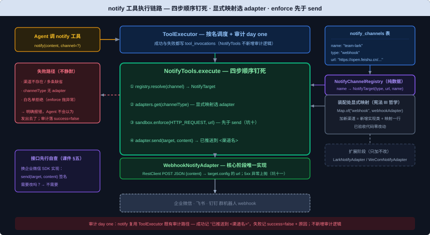

# Notify 模块设计文档

> 需求编号：004-notify | 对应主体阶段 US-4（Plugin Tool，核心能力四；课件第 19 节：Notify 模块）
> 文档依据：`docs/TechnicalSolution.md` §6.7/§6.8/§8.4/§9.2、`docs/DemandAnalysis.md` §5.6/§13、`docs/AiProgrammingGuide.md` §4.4（权威设计源）；课件《第 19 节：Notify 模块 原理解析、实现与代码讲解》（course repo `D:\code\oryxos\docs\class\`，实施级事实源）
>
> 修订说明（2026-09-03）：本版对齐课件第 19 节——① 冲突点经用户拍板（2026-09-03）：课件"`notify_channels` 是 `AGENT.md` frontmatter 字段、`NotifyTools` 经 `ProfileContext.resolveNotifyChannel` 解析"与技术方案 §6.8/§493"SQLite 全局注册表、frontmatter 不含此字段、Agent 正文按名引用"冲突 → **按技术方案 §6.8 全局注册表**（课程第 31 节已拍板过同一方向，技术方案是拍板后的新版，课件第 19 节为旧版；002-react"冲突一律参照课件"拍板不适用本次）；② `notify_channels` 的 CRUD REST 端点与 Web 管理页**归 Web Service 节**（用户拍板），本节只交表 + Repository + 解析服务；③ 时序适配：课件"`NotifyTools` 完整接线依赖 20/24 节"在 OryxOS-one 中对应——`OryxTool`/`ToolResult`/`Sandbox` 接口已由 001/002 交付，`NotifyTools` 类与单测本节即可实现；注册进工具集归第 20 节 ToolRegistry、`WhitelistSandbox` 实现归第 23/24 节（002 contracts/sandbox.md 既定契约）；④ 课件骨架的 `@Tool` 注解形态机械适配为 OryxOS-one 的 `OryxTool` 抽象（`io.oryxos` → `com.oryxos` 同款机械适配）；⑤ adapter 选择职责经用户拍板（2026-09-04，从长久稳定性角度）：`NotifyTools` 持装配处显式 `Map<channelType, NotifyChannelAdapter>` 按 type 选择，`NotifyChannelRegistry` 保持纯数据解析——与技术方案 §6.8 字面"注册表解析适配器和 URL"不完全一致，按拍板执行（跨节契约越小越稳、显式映射呼应宪法 III）；⑥ 默认渠道口径经用户拍板（2026-09-04）：**注册表恰好一条渠道才允许缺省，多条或为空时缺省明确报错**——与课件 §四测点"取第一个渠道"不一致，按拍板执行（推错群是不可见的错误，把出错窗口压到最小）。
>
> 修订说明（2026-09-05，oryx-spec S3 补列）：oryxos-tool pom 实测现状仅 core + spring-ai-model——`NotifyChannelRegistry` 消费 `NotifyChannelRepository` 需增 `oryxos-storage`（compile，符合 CLAUDE.md 能力层依赖 storage 方向），模块首个测试需增 `spring-boot-starter-test`（test，core 同款先例）。两项均为机器可判结构件，经 G2 用户确认补列交付清单（003 父命令类先例）。
>
> 修订说明（2026-09-05，交付后复盘修复，用户拍板）：① `NotifyTarget` 增 config 键常量 `KEY_URL`/`KEY_NAME` + 便捷访问器 `url()`/`name()`（缺失/空串明确报错——键名不散落、空串防线内置，复盘 E1/S4）；② `NotifyTools.execute` 增 `content` 必填校验（缺失/JSON null/空串 → 明确失败不 NPE 不推"null"，复盘 S1）；③ 跨节契约 contracts/notify-channel.md 增补不变量第 9 条（装配处 MUST 用 Boot 自动配置 RestClient.Builder + connect/read timeout，复盘 S2）。全量门禁重跑全绿。
>
> 修订说明（2026-09-05，人工验收修复，用户拍板）：④ **body 格式 40008 实锤修正**——真实企业微信 webhook 对课件骨架的 `{"content": content}` 返回 `errcode: 40008 invalid message type`（HTTP 200，群里收不到）；改为通用 text 格式 `{"msgtype":"text","text":{"content":...}}`（企业微信与钉钉共用此形态，实测 `errcode: 0`；飞书 text 格式不同，归扩展阶段专用 Adapter）。课件/技术方案"三平台吃通用 webhook"表述修正为"企微+钉钉共用 text 通用格式"。

## 背景与价值

一句话：**入站有 Channel Adapter 负责"消息怎么进来"，出站缺一个对称的东西负责"消息怎么出去"——`NotifyTools` 补的就是这一块**（技术方案 §6.8、课件 §一）。

CLI（003）和 Web Service 都是"人推"：有人发起一次调用，Agent 处理完直接把响应返回给发起者，走同一条请求-响应链路，不需要额外的推送机制。但一旦触发源变成"到点自动"（定时查天气、每天汇总科技新闻），这条链路就断了——没有人在另一端等着接收响应，Agent 必须**主动**把结果送到人能看到的地方（企业 IM 群）（课件 §一、技术方案 §6.8）。第 25 节定时模块和 31 节的天气、日报 Agent 才有地方把结果真正交出去，不然到点跑完一整套 ReAct 循环，结果只能烂在 Session 里没人看到（课件 §五）。

**如果没有这个模块会怎样**：每个业务方定义 Agent 时都要自己在 Skill 里手写"调 `http_post` 打这个 webhook URL"，或者自己找一个企业微信/飞书的 MCP server 配上——每个 Skill 各写一份，重复且不统一，跟 Sandbox、Memory 强调的"接口先行"原则相反（技术方案 §6.8、课件 §一）。`NotifyTools` 要统一掉的是"往外推一条消息"这件最常见的事——这也是"接口先行"设计习惯在课程里的第一次亮相（课件 §一）。

动手前定死四件事（课件 §二）：① **先定接口，别先定实现**——接口表达"把一条内容送到某个通知目标"的意图，不出现"企业微信""飞书"这类某一档实现特有的词，核心阶段只在接口后面挂一档实现，以后加新渠道只新增实现类；② **核心阶段只做通用 webhook，不逐家接专用 API**——企业微信、飞书、钉钉的群机器人都提供 webhook 地址，签名算法、AccessToken 刷新留给扩展阶段；③ **安全校验先占位**——`notify` 发出去的是一次 HTTP 请求，理应跟 `http_post` 一样过域名白名单，不能因为它是"往外推"就绕过去，白名单怎么校验归 23/24 节 Sandbox 展开；④ **具体推到哪是配置，不暴露在对话里**——经拍板适配为技术方案 §6.8 版：webhook 地址存 SQLite 全局注册表（`notify_channels` 表），LLM 调用时只传 `content` 与可选 `channel` 名。

前序关系：002 已交付 `ToolExecutor`（按名调度 + 审计 day one）、`OryxTool` 抽象、`Sandbox` 接口墙——本课是 **Sandbox 接口的第一个消费方**（002 contracts/sandbox.md 明列"第 19/20 节 `NotifyTools`（HTTP_REQUEST 校验）"），也是"接口先行"从图纸变实物的第一站（技术方案 §6.8"跟 6.7 Sandbox 同样的思路"）。

## 用户场景

**场景一（本节验收场景）：配置好的群里收到 Agent 推的消息**
用户给底座配好一个通知渠道（写入 `notify_channels` 表：`team-lark` → 团队群 webhook），在对话里对 Agent 说"把'测试消息'推送一下"——Agent 调 `notify(content="测试消息")`，团队群里收到这条消息（课件 §五）。完整对话版依赖第 20 节工具注册，本节的验收锚点是 notify 工具自身链路：注册表解析 → `enforce` 校验 → 真实 webhook 收到消息；LLM 在对话里自动调 `notify` 的端到端版在 20 节后补验（课件 §五、技术方案 §6.8）。

**场景二：换渠道不碰 Agent**
运营要把推送目标从测试群换成生产群：只需在全局注册表里改一行 URL（CRUD 归 Web Service 节），`AGENT.md` 正文里按名引用渠道的写法一个字不动；webhook 地址不进对话、不进 `AGENT.md` frontmatter（技术方案 §6.8"具体 webhook 地址不进入对话，增加或修改渠道也无需改 Agent"）。

**场景三：出站与入站同一道墙**
`notify` 往外推的是一次 HTTP 请求，发送前必须先过 `Sandbox.enforce(HTTP_REQUEST, url)` 域名白名单校验——不能因为"往外推"就绕过去；白名单规则（`http.allowed_domains`）与 `http_post` 共享同一份，不新增 Sandbox 概念（课件 §二第三、技术方案 §6.8）。

**场景四：定时日报 Agent 的出口**
天气/科技日报 Agent 到点自动跑完一整套 ReAct 循环后调 `notify(channel="team-lark", content="今日天气…")`，结果主动推到群里——这是 Demo 一钟推版（25 节）与 Demo 二/三（31 节）的出站契约，本节先把"往外推"这个能力本身交付掉（技术方案 §6.8、§747 流程、课件 §五）。

## 功能需求

> 从课件一、二、三部分提炼：编程指南 §4.4（US-4 内置 Tool 补齐类）、技术方案 §6.8、需求文档 §5.6/§13。**交付物列是本节对外概念的白名单**，清单之外的新增对外概念必须停下报告。

| 编号 | 需求 | 交付物（落位模块） | 来源 |
|------|------|-------------------|------|
| FR-1 | **`NotifyChannelAdapter` 接口（接口先行）**：唯一方法 `send(NotifyTarget target, String content)`，表达"把一条内容送到某个通知目标"的意图——签名不出现"webhook""企业微信""飞书"等任何一档实现特有的词；核心阶段只在接口后面挂一档实现，以后加新渠道只新增实现类、不改接口、不改调用方 | `NotifyChannelAdapter` 接口（oryxos-tool） | 课件 §二第一/§三骨架；技术方案 §6.8 |
| FR-2 | **`NotifyTarget`**：record，两个字段 `channelType` + `config: Map<String, String>`；具体是 webhook 地址还是别的认证信息由实现类自己解释，接口层不携带任何实现细节。**键约定（2026-09-05 拍板补强）**：config 键常量 `KEY_URL`/`KEY_NAME` + 便捷访问器 `url()`/`name()`（缺失或为空明确报错）——键名不散落调用方、空串防线内置 | `NotifyTarget`（oryxos-tool） | 课件 §三骨架；技术方案 §6.8；复盘 S1/E1 修复 |
| FR-3 | **`WebhookNotifyAdapter`（核心阶段唯一实现）**：用 `RestClient` 对 `target.config` 里的 `url` 发 POST，`contentType` 为 JSON、body 为通用 text 格式 `{"msgtype":"text","text":{"content": content}}`（**2026-09-05 人工验收 40008 实锤修正**：课件骨架的 `{"content": content}` 被企业微信判 invalid message type——企业微信与钉钉共用 msgtype/text/content 形态，飞书 text 格式不同归扩展阶段专用 Adapter）；URL 只从 `NotifyTarget.config` 取、**不得硬编码**；**坑十一：webhook 返回 5xx 或网络失败时异常原样上抛，不静默吞掉**（吞掉 = Agent 以为发出去了）；核心阶段不接各家签名算法、AccessToken 刷新 | `WebhookNotifyAdapter`（oryxos-tool） | 课件 §二第二/§三骨架/§四第一批测试点；技术方案 §6.8；2026-09-05 人工验收实测 |
| FR-4 | **`notify_channels` 全局注册表（拍板：技术方案 §6.8 版）**：SQLite 新增 `notify_channels` 表——`name`（TEXT PK，注册名）、`type`（TEXT，渠道类型）、`url`（TEXT）、`description`（TEXT 可空），手工 schema.sql 增量追加（坑八口径：不依赖 `ddl-auto=update`）；JPA 实体 + Repository（storage 模式机械延伸，`SessionEntity`/`SessionRepository` 先例）；**`AGENT.md` frontmatter 不含 `notify_channels` 字段**（课件版 Profile 字段方案经拍板否决——技术方案 §493"`notify_channels` 不属于 Profile 或 frontmatter；通知渠道由 SQLite 全局注册表管理，Agent 只在正文中按名称引用"）；webhook 地址不进对话、不进配置键 | `NotifyChannelEntity` + `NotifyChannelRepository` + schema.sql 增量（oryxos-storage） | 技术方案 §6.8/§493；拍板结论（2026-09-03）；002 坑八口径 |
| FR-5 | **注册表解析服务（纯数据，拍板）**：按渠道名解析出 `NotifyTarget`（`channelType` = 表 `type` 列，`config` 含 `url` 与渠道 `name`——name 供审计结果带渠道名用，实现级明确）；查不到 → 明确报错，不静默、Agent 不会以为发出去了；**`channel` 缺省口径（拍板 2026-09-04）：注册表恰好一条渠道才允许缺省取它，多条或为空时缺省 → 明确报错要求显式指定 channel**（课件"取第一个渠道"口径经拍板否决——推错群是不可见的错误）；adapter 选择不在本类（拍板：本类纯数据，选择归 `NotifyTools`） | `NotifyChannelRegistry`（oryxos-tool；类名为实现级明确——技术方案 §6.8"从注册表解析"的落位） | 技术方案 §6.8；课件 §四"未配置 → 明确报错"；拍板结论（2026-09-04） |
| FR-6 | **`NotifyTools`（`notify` 内置 Tool）**：implements `OryxTool`（`getName` = `"notify"`；schema 两参数——`content` 必填、`channel` 可选；课件 `@Tool` 注解骨架机械适配为 OryxOS-one 的 `OryxTool` 抽象）；**`content` 必填校验（2026-09-05 拍板补强，复盘 S1）**：缺失/JSON null/空串 → `ToolResult.failure`（明确报错、不 NPE、不推送字面 "null"，失败走 ToolExecutor 审计 success=false）；`execute` 四步顺序钉死：① 从注册表按 `channel` 名解析 `NotifyTarget`（缺省口径见 FR-5）② 按 `target.channelType()` 从**装配处显式 `Map<channelType, NotifyChannelAdapter>`** 选 adapter——**显式映射不靠容器扫描（宪法 III 同一哲学）**，未知 type → 明确报错 ③ **`sandbox.enforce(new SandboxAction(HTTP_REQUEST, url))` 先于 `send`（坑十）**——`enforce` 是涉外 IO 的工具在 `execute` 首行自执行（002 contracts/sandbox.md 行为不变量三），违反顺序 = 白名单被"往外推"绕过 ④ `adapter.send(target, content)`。成功返回 **`"已推送到 <渠道名>"`（审计带渠道名**——`tool_invocations.result_json` 可查出推给了谁，不裸记"已推送"）。审计复用 `ToolExecutor` 既有成功/失败路径（`tool_invocations`），不新增审计逻辑（技术方案 §6.8）；Sandbox 注入接口（本节测试 mock，`WhitelistSandbox` 归 23/24 节） | `NotifyTools`（oryxos-tool，implements `OryxTool`） | 课件 §三骨架/§四 InOrder 测试点；技术方案 §6.8；002 contracts/sandbox.md；拍板结论（2026-09-04/09-05） |
| FR-7 | **模块依赖与装配**：oryxos-tool pom 增加 `oryxos-storage`（compile，Registry 消费 Repository 所需，2026-09-05 补列）+ `spring-web`（`RestClient`）+ `spring-boot-starter-test`（test，模块首个测试所需，2026-09-05 补列）+ 测试依赖 `com.squareup.okhttp3:mockwebserver`（全仓首次引入，机械）；`WebhookNotifyAdapter` 构造注入 `RestClient`（课件签名逐字），bean 装配由装配处用 Boot 自动配置的 `RestClient.Builder` 构建，**设 connect/read timeout**（实现级明确——慢 webhook 不得拖死 ReAct 轮次）；**adapter 显式映射装配（拍板）**：装配处构建 `Map.of("webhook", webhookAdapter)` 注入 `NotifyTools`，加新渠道 = 新增实现类 + 映射表加一行，已验收代码零改动；**`NotifyTools` 注册进工具集归第 20 节 ToolRegistry**（`ToolExecutor` 现注入空 Map——003 FR-10 口径，本节交付类 + mock 单测） | oryxos-tool pom + `RestClient` bean 装配 + adapter 显式映射（实现级明确） | 课件 §三；003 FR-10；CLAUDE.md 模块结构；宪法 III 显式映射哲学；拍板结论（2026-09-04） |
| NFR-1 | 全程同步阻塞，不引入异步模型；并发由 Java 21 虚拟线程承担 | — | 宪法 VII；002 NFR-1 延续 |
| NFR-2 | 结构化 JSON 日志沿用既有地基；webhook URL 等渠道配置不进日志参数（002 CRLF 口径延续） | — | 002 NFR-2 延续 |
| NFR-3 | 审计 day one：`notify` 成功与失败都进 `tool_invocations`——复用 `ToolExecutor` 既有路径即满足，不新增审计逻辑 | — | 技术方案 §6.8；宪法 V |



### 核心代码骨架（与课件第 19 节一致，包名机械适配 com.oryxos）

```java
// oryxos-tool：com.oryxos.tool.notify —— 接口先行：签名零渠道词（课件 §三逐字）
public interface NotifyChannelAdapter {
    void send(NotifyTarget target, String content);   // 唯一方法：表达"送到某个通知目标"的意图
}

public record NotifyTarget(String channelType, Map<String, String> config) {
    // channelType + config：具体是 webhook 还是认证信息，由实现类自己解释（课件 §三）
}
```

```java
// oryxos-tool：com.oryxos.tool.notify —— 核心阶段唯一实现（课件 §三骨架）
@Component
public class WebhookNotifyAdapter implements NotifyChannelAdapter {

    private final RestClient restClient;

    public WebhookNotifyAdapter(RestClient restClient) {
        this.restClient = restClient;                 // 装配处用 RestClient.Builder 构建（实现级明确）
    }

    @Override
    public void send(NotifyTarget target, String content) {
        String url = target.url();                    // URL 只从 config 取，不硬编码
        restClient.post()
                .uri(URI.create(url))
                .contentType(MediaType.APPLICATION_JSON)
                .body(Map.of("msgtype", "text", "text", Map.of("content", content)))
                                                      // 40008 实锤修正：企业微信/钉钉要求 msgtype/text/content 包装
                .retrieve()
                .toBodilessEntity();                  // 5xx/网络失败：异常原样上抛，不吞（坑十一）
    }
}
```

```java
// oryxos-tool：com.oryxos.tool.builtin —— NotifyTools（课件 §三骨架，@Tool → OryxTool 机械适配）
@Component
public class NotifyTools implements OryxTool {

    private final Sandbox sandbox;                              // 注入接口：本节测试 mock，WhitelistSandbox 归 23/24 节
    private final Map<String, NotifyChannelAdapter> adapters;   // 拍板：装配处显式映射 channelType→adapter（宪法 III 哲学）
    private final NotifyChannelRegistry registry;               // 纯数据：按名查全局注册表（拍板：全局注册表版，adapter 选择不在本类）

    @Override
    public String getName() { return "notify"; }

    @Override
    public ToolResult execute(JsonNode input) {
        JsonNode contentNode = input.get("content");
        if (contentNode == null || contentNode.isNull() || contentNode.asText().isBlank()) {
            return ToolResult.failure("参数 content 必填且不能为空", false);  // 2026-09-05 拍板补强：不 NPE、不推字面"null"
        }
        String content = contentNode.asText();
        String channel = input.has("channel") ? input.get("channel").asText() : null;  // 可选 → 唯一渠道才缺省
        NotifyTarget target = registry.resolve(channel);         // 查不到/多条缺省：明确报错，不静默
        NotifyChannelAdapter adapter = adapters.get(target.channelType());  // 未知 type：明确报错
        sandbox.enforce(new SandboxAction(ActionType.HTTP_REQUEST,
                target.url()));                                   // 坑十：enforce 先于 send——顺序反了就是漏洞
        adapter.send(target, content);
        return ToolResult.success("已推送到 " + target.name());   // 审计带渠道名
    }
}
```

```java
// oryxos-storage：schema.sql 增量（坑八口径：手工建表脚本，测试执行同一份）
CREATE TABLE IF NOT EXISTS notify_channels (
    name        TEXT PRIMARY KEY,   -- 注册名：Agent 正文按此名引用渠道
    type        TEXT NOT NULL,      -- 渠道类型（核心阶段均为 webhook）
    url         TEXT NOT NULL,      -- webhook 地址（扩展阶段其他类型自行解释）
    description TEXT                -- 可选描述
);
```

### 本节交付物清单（Spec-Kit 拆解锚点 / oryx-spec 交付清单比对基准）

- **代码**：`NotifyChannelAdapter` 接口、`NotifyTarget`、`WebhookNotifyAdapter`、`NotifyChannelRegistry`（类名实现级明确）、`NotifyTools`（implements `OryxTool`）——以上落 oryxos-tool（包结构建议：`com.oryxos.tool.notify` 子包放接口+Target+WebhookAdapter+Registry，`NotifyTools` 落 `com.oryxos.tool.builtin`，课件 `io.oryxos` 机械翻译，实现级明确）；`NotifyChannelEntity` + `NotifyChannelRepository`（oryxos-storage，storage 模式机械延伸结构件）；oryxos-tool pom 增加 `oryxos-storage`（compile，Registry 消费 Repository 所需，2026-09-05 补列）+ `spring-web`（RestClient）+ `spring-boot-starter-test`（test，模块首个测试所需，2026-09-05 补列）+ `mockwebserver`（测试）+ `spotbugs-annotations`（provided，编译期门禁配套——RestClient 第三方可变接口的 EI_EXPOSE_REP2 抑制注解，001-provider 同款先例，2026-09-05 补列）
- **测试**：`WebhookNotifyAdapterTest`（第一批，MockWebServer 假 webhook）、`NotifyToolsTest`（第二批，mock Sandbox/adapter Map/Registry）、`NotifyChannelRegistryTest`、`NotifyChannelRepositoryTest`（坑八口径）
- **表**：`notify_channels`（`name` PK、`type`、`url`、`description`；schema.sql 增量追加）
- **约定**：接口先行（签名零渠道词）；`enforce` 先于 `send`（坑十）；webhook 失败异常上抛不吞（坑十一）；`AGENT.md` frontmatter 不含 `notify_channels`（拍板）；渠道 CRUD REST 归 Web Service 节（拍板）；adapter 显式映射按 channelType 选择、Registry 纯数据（拍板，宪法 III 哲学）；`channel` 缺省 = 注册表恰好一条渠道才允许（拍板）；审计结果带渠道名；`NotifyTools` 注册进工具集归第 20 节；MockWebServer 属单测层、不算外网依赖（课件 §四）

### 配置形态示例

本节**无新增配置键**——渠道数据是 `notify_channels` 表的行，不是 yaml 配置键、不进 `AGENT.md` frontmatter（拍板：技术方案 §6.8）。数据形态示意（CRUD 归 Web Service 节）：

```sql
INSERT INTO notify_channels (name, type, url, description) VALUES
  ('team-lark', 'webhook', 'https://open.feishu.cn/open-apis/bot/v2/hook/xxx', '团队群机器人');
```

## 明确不做

> 来源：课件"依赖 20/24 节"时序说明 + 技术方案 §6.8 + 需求文档 §5.6/§6.x + 拍板结论。

- **`/api/v1/notify-channels` CRUD 端点与 Web 管理页**：归 Web Service 节（2026-09-03 拍板；技术方案 §6.8"通过 Web 管理台或 API 做 CRUD"——本节只交表 + Repository + 解析服务）
- **`AGENT.md` frontmatter 的 `notify_channels` 字段**：拍板否决（课件旧版方案；技术方案 §6.8/§493），本节不翻案
- **企业微信/飞书/钉钉专用 Adapter**（签名算法、AccessToken 刷新、富文本卡片）：扩展阶段（课件 §二第二、技术方案 §6.8"核心阶段不做"）
- **MCP 方式二接专用通知 server**：与 `notify` 并存的两条路，`notify` 只统一"最常见的纯文本/webhook 推送"，不吃掉 MCP 方式二的复杂格式场景（技术方案 §6.8 边界）
- **`WhitelistSandbox` 三层白名单实现**：归第 23/24 节（002 FR-7 已定；本节只"先接进去"——`enforce` 调用先行、实现后补）
- **工具集注册（`ToolRegistry`）**：归第 20 节（003 FR-10 口径）；`NotifyTools` 类与单测本节交付，注册进 `ToolExecutor` 的工具 Map 与生产 bean 接线 20/24 节就位后生效
- **定时触发（`AgentScheduler` 钟推）**：归第 25 节；本节验收场景是对话版手动触发（课件 §五）
- **入站 Channel 与出站 Notify 合并抽象**：语义方向相反（"什么触发 Agent 开始跑" vs "Agent 跑完把结果送到哪"），分开建模不合并；同一个企业微信群可同时是 A Agent 的入站 Channel、又是 B Agent 的出站通知目标（技术方案 §6.8）
- **webhook body errcode 解析**：企业微信/飞书/钉钉"HTTP 200 + 业务错误码"（token 失效、限频等）核心阶段不解析——只认 HTTP 状态码，errcode/code 字段解析留扩展阶段按渠道专用 Adapter 做；人工验收时留意"200 但群里没收到"（课件/技术方案均未覆盖，本节明确留白）
- **4xx/5xx 重试语义细分**：`ToolExecutor` 对异常统一标 `retryable=true`，本节不做 4xx（URL 错/token 失效）不可重试的区分——重试与否由 LLM 下一轮判断，错误路径已在审计留痕（留白）
- **消息长度限制处理**：群机器人消息有长度上限，超长由平台截断或拒绝，本节不做截断处理（留白）

## 验收标准

### 自动化部分（harness 承载，`mvn clean verify` 全绿即通过）

需求文档 §13 功能验收点：内置 Tool（文件、HTTP、Shell、save_memory、recall_memory、**notify**）。

**harness 分层对齐课件 §四两批**：全部单测、不碰外网——`WebhookNotifyAdapterTest` 用 MockWebServer 在本地起假 webhook（课件明示"不算外网依赖，仍是单测层"），真 webhook 验证挪人工部分：

| 测试类 | 关键回归点 |
|--------|-----------|
| `WebhookNotifyAdapterTest` | 发送后断言假 webhook 收到的 POST：body 带 `content`；URL 来自 `NotifyTarget.config` 而不是硬编码；**坑十一回归**：webhook 返回 5xx 时异常上抛、不静默吞掉 |
| `NotifyToolsTest` | mock `Sandbox`/adapter Map/`Registry`：渠道未配置 → 明确报错（不是静默失败）；`channel` 缺省 → 唯一渠道取它、多条报错；**adapter Map 无对应 channelType → 明确报错**；**坑十回归：`enforce` 先于 `send` 被调用**（InOrder 顺序断言） |
| `NotifyChannelRegistryTest` | 按名解析命中 → 返回对应 `NotifyTarget`（config 含 url+name）；未命中 → 明确异常；**缺省口径：恰好一条才取它、多条或为空 → 明确报错**（拍板口径） |
| `NotifyChannelRepositoryTest` | **坑八口径**：测试执行手工 schema.sql 建表（不让 Hibernate 自动建）；`notify_channels` 可存可读；`name` 主键唯一约束生效；`description` 可空 |

**最值钱的回归测试**（课件 §四原文，坑十钉死）：

```java
@Test
void 发送前必须先过白名单校验() {
    notifyTools.execute(objectMapper.createObjectNode().put("content", "hello"));

    InOrder inOrder = inOrder(sandbox, adapter);
    inOrder.verify(sandbox).enforce(argThat(a -> a.type() == ActionType.HTTP_REQUEST));
    inOrder.verify(adapter).send(any(), eq("hello"));   // 校验在前，发送在后——顺序反了就是漏洞
}
```

跑法：`mvn test` 日常全跑（全绿才算实现完成）。

### 人工部分（做完怎么验）

- **真实 webhook 收到消息**：构造 `WebhookNotifyAdapter` + 指向真实群 webhook 的 `NotifyTarget` 直接调 `send`，群里收到——假 webhook 测的是协议，真 webhook 验的是配置（课件 §五；可直接用测试类临时 main 或 jshell 完成，完整"LLM 在对话里调 `notify`"的端到端版在 20 节工具注册后补验）
- **接口中立性自查（思维练习，测不出来）**：换成企业微信官方 SDK 的实现，`NotifyChannelAdapter.send(NotifyTarget, String)` 这个签名需要改吗？答案应该是不需要（课件 §五）
- **落库核对**：打开 `.oryxos/oryxos.db` 核对 `notify_channels` 表 4 列结构与插入数据；推送成功后 `tool_invocations` 里 notify 的 `result_json` **带渠道名**（"已推送到 team-lark"，不裸记"已推送"）
- **errcode 陷阱留意**：真实 webhook 验证时留意"HTTP 200 但群里没收到"——企业微信/飞书/钉钉业务失败时 HTTP 层仍是 200（核心阶段不解析 body errcode，明确不做），遇到即记入已知留白
- **反例验证**：注册表里没有该渠道名时调 `notify` → 明确报错、`tool_invocations` 落一条 `success=false`（不静默、Agent 不会以为发出去了）；注册表多条渠道且不传 `channel` → 同样明确报错（拍板口径）
- **人工 review 关键代码**：`WebhookNotifyAdapter.send` 的异常上抛路径（坑十一）；`NotifyTools.execute` 执行顺序——adapter 按 channelType 显式映射选取、`enforce` 在 `send` 之前（坑十，最该盯的一段）
- 渠道未配置报错、白名单先行、失败不吞——已由 harness 覆盖，`mvn test` 绿即打勾（课件 §五）

## 依赖与假设

### 前序交付物（已就位，本节直接依赖）

- **001-provider**：`OryxTool` 接口（`getName`/`getDescription`/`getInputSchema`/`execute`）、`ToolResult`（success/content/errorMessage/retryable）、`JsonSchema`、`ObjectMapper` 装配先例
- **002-react**：`ToolExecutor`（按 `Map<String, OryxTool>` 调度、审计 day one、**不持 Sandbox**——涉外工具 `execute` 首行自 enforce）、`Sandbox` 接口墙四件套（`Sandbox`/`SandboxAction`/`ActionType`（含 `HTTP_REQUEST`）/`SandboxViolationException`）、`ProfileContext`、`contracts/sandbox.md`（行为不变量三：接线约定；消费方明列"第 19/20 节 `NotifyTools`"）
- **003-cli**：JPA 实体 + Repository + schema.sql 手工增量模式（`SessionEntity`/`SessionRepository` 先例）、`CliAgentConfiguration` 装配先例（工具集空 Map，第 20 节替换口径）、坑八/坑九回归先例
- **storage 口径**：`InstantTextConverter`（ISO-8601 TEXT）、`schema.sql` 三表（`llm_calls`/`tool_invocations`/`sessions`）、`ToolInvocationRepository`（审计落账路径）

**现状确认（2026-09-03 实测）**：`oryxos-tool` 仅 `Sandbox` 接口四件套（Notify 零代码空壳）；`ToolExecutor` 注入空 Map；`Profile` 无 `notify_channels` 字段；`schema.sql` 三表无 `notify_channels`；oryxos-tool pom 仅依赖 core + spring-ai-model（无 spring-web）。与文档描述一致，无缺口。

### 前序缺口（H0 依赖检查）

无——"Sandbox 纯接口、零实现、无人调用"（002 FR-7）与"工具集注册归第 20 节"（003 FR-10）都是既定跨节契约，本课测试以 mock 承接、生产接线按契约在 20/24 节生效，不构成缺口。

### 改造点（经拍板允许修改的前序公共接口）

无前序公共接口改造——`Profile` 不动（课件版 `notify_channels` 字段方案拍板否决）、`ToolExecutor`/`OryxTool`/`Sandbox` 原样使用。前序产物上的变化仅为：schema.sql 增量追加 `notify_channels` 表、oryxos-tool pom 增加依赖（均为增量，不改既有结构）。

### 外部依赖与假设

- **Spring AI 边界**：notify 不碰模型调用（`ProviderService` 防线延续）；本课不新增模型相关代码
- **`RestClient`**：Spring Boot 3.5 自带（`spring-web`），`RestClient.Builder` 由 Boot 自动配置；`RestClient` bean 装配方式为实现级明确（建议装配处 `RestClient.Builder` 构建后注入 `WebhookNotifyAdapter`），**并设 connect/read timeout**（慢 webhook 不拖死 ReAct 轮次）
- **MockWebServer**：`com.squareup.okhttp3:mockwebserver` 测试依赖，全仓首次引入（2026-09-05 H3 实测修正：Boot 3.5 BOM **不**管理 okhttp3，采用显式版本 4.12.0——与本机已落库的 okhttp 4.12.0 同版对齐）
- **运行时环境**：webhook 地址可达企业 IM 群机器人端点（人工验收时用户提供真实 webhook）
- **重试语义留白**：webhook 4xx（URL 错、token 失效）与 5xx 同走 `ToolExecutor` 的 `retryable=true` 口径，不做细分——重试与否由 LLM 下一轮判断，错误路径已在审计留痕（核心阶段有意留白，非遗漏）
- **跨节契约**：本节交付的 `NotifyChannelAdapter`/`NotifyTarget`/`WebhookNotifyAdapter`/`NotifyChannelRegistry`/`NotifyTools` 与 `notify_channels` 表口径，是第 25 节（定时触发后推送）、第 27/28 节（全流程串联）、第 31 节（Demo 二/三 日报推送）的出站调用契约——后续节不得改动已验收行为；Web Service 节做 CRUD 端点时直接消费 `NotifyChannelRepository` 与本表口径
- **跑通标准**：本节 + 001/002/003 补上 Demo 一钟推版的"推送半程"——`notify` 工具自身链路（注册表解析 → `enforce` → 真实 webhook 收到）走通；"到点自动触发 + LLM 在对话里调 `notify`"的完整版按契约在第 20 节（工具注册）、第 25 节（定时）就位后补验（课件 §五、技术方案 §747）
