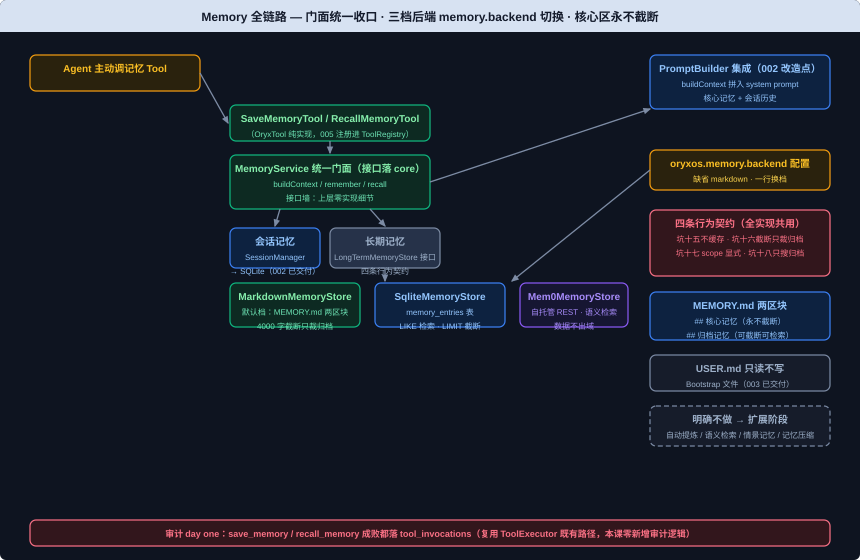

# Memory 模块设计文档

> 需求编号：006-memory | 对应主体阶段 US-3（Memory 三层记忆，核心能力三；课件第 21/22 节）
> 文档依据：`docs/AiProgrammingGuide.md` §4.3、`docs/TechnicalSolution.md` §5/§9.1/§9.3、`docs/DemandAnalysis.md` §5.5/§10/§13、`docs/IndustryResearch.md` §3.4/§5.1；课件第 21 节《Memory 原理解析、业界方案与 OryxOS 设计评审》（旧 .md 回查，D:\code\oryxos\docs\class\）+ 第 22 节《Memory 实现与代码讲解》**新版 PDF**（`D:\项目\`，实施级事实源；旧 .md 版"只做文件式"已过时）
>
> 修订说明（2026-09-06）：本版对齐新版课件与拍板结论——**整体以 `D:\项目\` 新版 PDF 课件为准**（2026-09-06 用户指示；旧 .md 课件已过时，仅第 21 节等 PDF 未覆盖的设计评审背景回查）① 后端档位经用户拍板（2026-09-06）：**一次交付三档**（`MarkdownMemoryStore` 默认 / `SqliteMemoryStore` / `Mem0MemoryStore` + `memory.backend` 配置切换，技术方案 §5.1 字面与新课件一致）② `MemoryService` 接口落 **oryxos-core**（依赖倒置——PromptBuilder 在 core 调它，避免 core←memory 反向依赖，001 `LlmGateway` 同款先例），实现/三档后端/两 Tool 落 oryxos-memory ③ 课件 `@Tool` 注解骨架机械适配为 OryxOS-one 的 `OryxTool` 纯实现（005 拍板延续）：`SaveMemoryTool`/`RecallMemoryTool` 两顶层类（一个类只能实现一个 getName）④ 坑编号全局递增：坑十五（不缓存）/坑十六（截断只裁归档）/坑十七（scope 显式）/坑十八（检索只搜归档）——对应课件节内"坑一~坑四"（节内编号与全仓坑一~坑十四冲突）⑤ Mem0 档验证口径（用户确认）：单测 mock HTTP 层（MockWebServer 假 Mem0 服务，005 先例），真实自托管 Mem0 的人工验证如实记待办（本地无实例）⑥ **设计期自审修复（2026-09-06，用户拍板修入）**：#1 并发写（FR-3 双层互斥 + 锁内重读）、#4 原子写（FR-3 临时文件 + ATOMIC_MOVE）、#2 后端故障快速失败不静默（FR-6）、#3 注入扫描列明确不做、#5 三档契约参数化测试（LongTermMemoryStoreTest）、#6 mem0 每轮延迟口径、#7 审计表记忆副本留存语义、#8 Mem0 HTTPS 口径、#9 手工编辑冲突记录。

## 背景与价值

一句话：**Agent 从 Demo 到生产要跨的头号坎是记忆**——周一通过全部评测、周三忘了用户名字，不是模型问题是记忆问题（课件 21 §一）。Provider/ReAct/CLI/Notify/Tool 让 Agent 会喂话、会想、会动手、会外推，Memory 补的是"记不记得住事"（课件 22 §一）。

大模型每次调用无状态，上下文窗口有限且昂贵——Agent Memory 的本质是在有限窗口之外管理一套"记得住东西"的机制（课件 21 §一）。短期记忆是本次对话的"工作台"（Session，002/003 已交付 SQLite 持久化），长期记忆是跨会话的"仓库"；两者之间有核心循环：短期里重要的固化成长期写出去、长期里相关的检索回来拼进上下文（课件 21 §二）。注意区分**上下文压缩**（管当下窗口）与**记忆压缩**（管长期仓库），核心阶段只做前者已有、后者放扩展（课件 21 §三）。

OryxOS 记忆模块的第一性原则：**不做最强的记忆系统，做够用、可控、能平滑长大的**（课件 21 §八）。"方向想清楚、接口设计对、实现只做当下"——接口这道墙之上现在设计好，墙之下按档位演进：文件式 → SQLite → 自托管 Mem0，换后端只改 `memory.backend` 一行配置，`MemoryService` 以上一字不动（技术方案 §5.1）。"当下"的范围经拍板（2026-09-06）扩到**一次交付三档**——接口墙的兑现面从第一天就完整可见（新课件 22 节与拍板一致）。

核心阶段不做自动提炼是刻意的：写入靠 Agent 主动调 `save_memory`、`scope` 显式声明（坑十七），这是信号驱动升级原则的体现——等"手动记忆明显漏东西"的真实信号出现，自动提炼才作为扩展阶段候选（课件 21 §十/§十一）。长期记忆分**核心记忆**（始终在场、永不截断，借 MemGPT core memory 思想）与**归档记忆**（按需检索、超阈值只裁这一区，坑十六）（课件 21 §七/§十、技术方案 §5.2）。

## 用户场景

**场景一（本节验收场景）：跨对话记偏好**——第一次对话告诉 Agent"我项目用 Spring Boot，部署在 K8s 上"，Agent 主动调 `save_memory` 写入；重启 OryxOS 或新开会话；第二次对话问"我的项目能用什么数据库"，Agent 在响应里引用之前记的偏好给建议（编程指南 §4.3 Demo 二对话版）。

**场景二：核心记忆始终在场**——用户的关键约束（身份、项目背景、偏好）存在核心区，每次对话都完整注入 system prompt，不管归档区积累了多少、截断了多少（坑十六：核心区一字不能少）。

**场景三：记忆量增长后的平滑升级**——归档记忆从几十条涨到上千条、关键词检索开始找不准：把 `memory.backend` 从 markdown 换成 sqlite（结构化查询）或 mem0（语义检索），上层 PromptBuilder/MemoryTools 一行不改（技术方案 §5.1 接口墙价值兑现；信号驱动口径课件 21 §十一）。

**场景四：USER.md 与 MEMORY.md 的边界**——`USER.md` 是用户手写的初始设定、OryxOS 只读不写；`MEMORY.md` 是 Agent 通过 `save_memory` 写的成长记录、OryxOS 读写。两者都进 system prompt，但来源和生命周期不同（技术方案 §5.4）。

## 功能需求

> 从课件第 22 节新版 PDF 与技术方案 §5 提炼：编程指南 §4.3（US-3 任务大类）、需求文档 §5.5/§13。**交付物列是本节对外概念的白名单**，清单之外的新增对外概念必须停下报告。

| 编号 | 需求 | 交付物（落位模块） | 来源 |
|------|------|-------------------|------|
| FR-1 | **`MemoryService` 统一门面（接口落 core，依赖倒置）**：对 ReAct 循环只暴露一个接口，内部把会话记忆委托给 `SessionManager`（SQLite）、长期记忆委托给 `LongTermMemoryStore`——上层不需要分别问两个地方。三方法：`buildContext(Session)`（核心记忆 + 会话历史，供 PromptBuilder）、`remember(content, scope)`（供 save_memory）、`recall(keyword)`（供 recall_memory）。接口放 oryxos-core（001 `LlmGateway` 依赖倒置先例：PromptBuilder 在 core 调它，core←memory 反向依赖不成立），实现落 oryxos-memory | `MemoryService` 接口（oryxos-core）+ 实现类 `MemoryServiceImpl`（oryxos-memory，类名实现级明确） | 课件 22 §一/§二；技术方案 §5.1 |
| FR-2 | **`LongTermMemoryStore` 可插拔后端接口**：长期记忆读写契约与具体存储解耦——三方法 `append(content, scope)` / `load()` / `recallByKeyword(keyword)`；**四条行为契约全实现共用**：①不缓存（每次重新读，坑十五）②核心记忆区永不截断、截断只作用归档区（坑十六）③写核心还是归档由 Agent 经 `scope` 显式指定、系统不猜（坑十七，`MemoryScope.CORE/ARCHIVAL`、缺省 ARCHIVAL）④recall 是关键词检索不做复杂化、只在归档区搜（坑十八） | `LongTermMemoryStore` 接口 + `MemoryScope` 枚举（oryxos-core，随接口落位——实现级明确） | 技术方案 §5.1；课件 22 §二 |
| FR-3 | **`MarkdownMemoryStore`（默认档）**：底层 `.oryxos/memory/MEMORY.md` 一个文件、`## 核心记忆`/`## 归档记忆` 两 header 分区（003 init 已建模板）；append 按 scope 写入对应区块（条目带日期前缀）；load 每次 `Files.readString` 重读（坑十五）、核心区完整返回、归档区超 4000 字只裁尾部（坑十六：截断函数只接收归档段，物理上动不到核心区）；recallByKeyword 用 `String.lines().filter(contains)` 朴素包含匹配（坑十八）。**并发与原子写约定（2026-09-06 自审补钉，多 Agent 单实例是核心阶段真实形态——跨会话虚拟线程并发 append 会丢记忆）**：① append 双层互斥——进程内 `synchronized` + 跨进程 `FileChannel.lock()`（JDK 原生零依赖），**锁内重读**文件再改（读-改-写全程互斥，不基于旧内容覆盖）② 写回用**临时文件 + `Files.move(ATOMIC_MOVE, REPLACE_EXISTING)`**（tmp 名带 UUID；同盘原子替换——任何时刻磁盘上要么旧文件要么新文件，不存在半写状态，这也是 load 免锁的正确性前提）③ append 失败异常上抛（不静默"已记住"），由 ToolExecutor 审计 success=false ④ load 不拿锁（原子写保证读不到半写；坑十五"每次重读"语义保持） | `MarkdownMemoryStore`（oryxos-memory） | 课件 22 §三；技术方案 §5.1/§5.2；自审 #1/#4 |
| FR-4 | **`SqliteMemoryStore`**：记忆按条入 `memory_entries` 表（`id` PK AUTOINCREMENT、`content`、`scope`、`created_at` ISO-8601 TEXT；**手工 schema.sql 增量，坑八口径**）；append→INSERT、load→CORE 全量 + ARCHIVAL 按时间倒序 LIMIT（对应截断语义）、recall→`LIKE '%keyword%'`；仍零外部依赖（复用已有 SQLite） | `SqliteMemoryStore` + `MemoryEntry` 实体 + `MemoryEntryRepository`（oryxos-memory / oryxos-storage 模式机械延伸） + schema.sql 增量 | 技术方案 §5.1 |
| FR-5 | **`Mem0MemoryStore`**：接**自托管** Mem0（数据不出域），Java 侧 `RestClient` 直连 REST API（005 装配先例：Boot builder + timeout），append/load/recall 翻译成 Mem0 的 add/get/search；凭证与地址走环境变量占位（`${MEM0_BASE_URL}`/`${MEM0_API_KEY}` 之类，001 口径）；**REST 协议以自托管版本文档为准、实施时 H3 核实**（核实不到 → 停止清单第 5 条）；核心/归档分区语义落到 Mem0 的 metadata | `Mem0MemoryStore`（oryxos-memory） | 技术方案 §5.1/§5.5；课件 21 §十二 |
| FR-6 | **`memory.backend` 配置键**：application.yaml 新增 `oryxos.memory.backend`（取值 `markdown`/`sqlite`/`mem0`，缺省 markdown）；缺失/非法值启动校验明确报错不静默（001 ConfigLoader 口径）；按值装配对应 `LongTermMemoryStore` 实现（装配处显式 @Bean，宪法 III 哲学）。**后端不可用行为（2026-09-06 自审补钉）**：load/append/recall 遇后端故障（mem0 服务挂、文件不可读、库损坏）→ **快速失败 + 明确报错**，MUST NOT 静默返回空记忆（记忆是 prompt 组装关键路径——静默失忆会让 Agent 带着错误认知作答，比报错更危险）；MUST NOT 自动降级换档（降级会掩盖选档配置错误，误导运维） | 配置键 `oryxos.memory.backend` + 装配逻辑（CliAgentConfiguration 改造） | 技术方案 §5.1；自审 #2 |
| FR-7 | **`MemoryTools` 两件（save_memory/recall_memory）**：implements `OryxTool` 纯实现（005 机械适配：手写 JsonSchema、无组件注解、注册进 ToolRegistry）；`SaveMemoryTool`：content 必填、scope 可选（core/archival，缺省 archival——坑十七：由 Agent 显式判断、工具层不猜），执行后返回"已记住"；`RecallMemoryTool`：keyword 必填，未命中返回"没有找到相关记忆"（不抛异常），命中返回换行拼接；两者只依赖 `MemoryService` 接口（core） | `SaveMemoryTool`/`RecallMemoryTool`（oryxos-memory，implements OryxTool） | 课件 22 §三；技术方案 §5.1 |
| FR-8 | **PromptBuilder 集成**：组装 system prompt 时调 `memoryService.buildContext(session)`，把核心记忆 + 会话历史拼入（归档区经 load 截断后注入）；长期记忆每次重新读不缓存（坑十五联动：save_memory 下一轮立刻可见）；**改造点：PromptBuilder 构造器新增 MemoryService 参数**（002 交付物签名变化，技术方案 §5.3 明文集成点） | `PromptBuilder` 改造（oryxos-core，002 交付物）+ `CliAgentConfiguration` 装配更新 | 技术方案 §5.3；课件 22 §三集成点 |
| NFR-1 | 全程同步阻塞，不引入异步模型；并发由 Java 21 虚拟线程承担；Mem0 REST 调用同步阻塞（RestClient） | — | 宪法 VII；001 NFR-1 延续 |
| NFR-2 | 审计 day one：save_memory/recall_memory 成败都落 `tool_invocations`——复用 ToolExecutor 既有路径（005 已注册进 Registry），本课零新增审计逻辑 | — | 宪法 V；005 口径延续 |
| NFR-3 | 结构化 JSON 日志沿用；**记忆内容与检索关键词不进日志参数**（用户隐私数据，CRLF 与敏感双口径） | — | 002 NFR 口径延续 |



### 核心代码骨架（与课件第 22 节新版一致，@Tool 形态机械适配为 OryxTool，包名机械适配 com.oryxos）

```java
// oryxos-core：com.oryxos.core —— 门面接口 + scope 枚举（依赖倒置，001 LlmGateway 先例）
public interface MemoryService {
    String buildContext(Session session);              // 给 PromptBuilder：核心记忆 + 会话历史
    void remember(String content, MemoryScope scope);  // 给 SaveMemoryTool
    List<String> recall(String keyword);               // 给 RecallMemoryTool
}

public enum MemoryScope { CORE, ARCHIVAL }             // 坑十七：写哪区由 Agent 显式指定
```

```java
// oryxos-core：com.oryxos.core —— 可插拔后端接口（四条行为契约全实现共用）
public interface LongTermMemoryStore {
    void append(String content, MemoryScope scope);
    String load();
    List<String> recallByKeyword(String keyword);
}
```

```java
// oryxos-memory：com.oryxos.memory —— 默认档（课件 LongTermMemory 逻辑，改名对齐技术方案 §5.1）
public class MarkdownMemoryStore implements LongTermMemoryStore {

    private static final String CORE_HEADER = "## 核心记忆";
    private static final String ARCHIVE_HEADER = "## 归档记忆";
    private static final int MAX_ARCHIVE_CHARS = 4000;   // 阈值只管归档区（坑十六）

    @Override
    public void append(String content, MemoryScope scope) { /* 按 scope 写入对应区块，条目带日期 */ }

    @Override
    public String load() {
        String raw = Files.readString(memoryFilePath());   // 每次都重新读（坑十五）
        String core = extractSection(raw, CORE_HEADER);      // 核心区：完整返回
        String archive = truncateIfNeeded(extractSection(raw, ARCHIVE_HEADER)); // 只裁归档段（坑十六）
        return core + "\n" + archive;
    }

    @Override
    public List<String> recallByKeyword(String keyword) {
        // 只在归档区搜（坑十八）；朴素 contains 行匹配
    }
}
```

```java
// oryxos-memory：com.oryxos.memory —— 两 Tool（课件 @Tool 骨架 → OryxTool 机械适配，005 先例）
public class SaveMemoryTool implements OryxTool {
    // getName() = "save_memory"；schema：content 必填、scope 可选（core/archival，缺省 archival——坑十七）
    // execute → memoryService.remember(content, scope) → ToolResult.success("已记住")
}

public class RecallMemoryTool implements OryxTool {
    // getName() = "recall_memory"；schema：keyword 必填
    // execute → memoryService.recall(keyword) → 未命中返回"没有找到相关记忆"（不抛异常）
}
```

### 本节交付物清单（Spec-Kit 拆解锚点 / oryx-spec 交付清单比对基准）

- **代码**：`MemoryService` 接口 + `MemoryScope` 枚举 + `LongTermMemoryStore` 接口（oryxos-core，依赖倒置）；`MemoryServiceImpl`（实现类名实现级明确）、`MarkdownMemoryStore`、`SqliteMemoryStore`、`Mem0MemoryStore`、`SaveMemoryTool`、`RecallMemoryTool`（oryxos-memory）；`MemoryEntry` 实体 + `MemoryEntryRepository`（oryxos-storage 模式机械延伸）；`PromptBuilder` 改造（oryxos-core，002 交付物）+ `CliAgentConfiguration` 改造（memory.backend 装配 + 两 Tool 注册 + MemoryService 注入）
- **测试**：`MarkdownMemoryStoreTest`（课件 LongTermMemoryTest 用例落位 + **并发追加不丢失回归**）、`LongTermMemoryStoreTest`（**参数化契约测试：遍历三档实现钉死四条行为契约**，2026-09-06 自审补钉——类名实现级明确）、`SqliteMemoryStoreTest`、`Mem0MemoryStoreTest`（mock HTTP 层）、`MemoryToolsTest`、`MemoryServiceTest`
- **表**：`memory_entries`（id PK AUTOINCREMENT / content / scope / created_at ISO-8601 TEXT；schema.sql 手工增量，坑八口径）
- **配置**：`oryxos.memory.backend`（markdown 缺省 / sqlite / mem0；非法值启动校验明确报错）
- **约定**：坑十五（不缓存）/坑十六（截断只裁归档）/坑十七（scope 显式）/坑十八（检索只搜归档）——四条行为契约全实现共用；USER.md 只读、MEMORY.md 可写；核心记忆永远完整不截断；自动提炼不做（信号驱动）；**并发与原子写**（双层互斥 + ATOMIC_MOVE + 锁内重读，FR-3）；**后端故障快速失败不静默**（FR-6）

### 配置形态示例

```yaml
# application.yaml —— 记忆后端切换（缺省 markdown，一行换档）
oryxos:
  memory:
    backend: markdown        # markdown / sqlite / mem0

# mem0 档（自托管，数据不出域；凭证走环境变量占位）
# MEM0_BASE_URL=http://自托管地址
# MEM0_API_KEY=${MEM0_API_KEY}
```

## 明确不做

> 来源：课件 21 §十一/§十二/§十四、技术方案 §5.5、需求文档 §5.5「核心阶段不做」、编程指南 §4.3 边界。

- **自动提炼/自动抽取**：核心阶段不做——写入靠 Agent 主动调 `save_memory`（信号驱动升级原则；Mem0 档的自带抽取是其外部能力，用不用取决于是否切该档——技术方案 §5.5 口径）
- **内置向量库/语义检索**：进程内不自建向量层（需要语义检索时切 `mem0` 档由外部服务承担）
- **情景记忆、Memory Wiki（claim/evidence 矛盾检测）、记忆压缩、知识图谱后端**：扩展阶段（课件 21 §十二）
- **门面层缓存**：扩展阶段可在 `MemoryService` 后加 in-memory cache + 失效机制（技术方案 §5.3；核心阶段"不缓存"是坑十五契约——缓存与坑十五存在根本张力，失效必须挂钩 save_memory，真成瓶颈时再上）
- **记忆写入的注入/外泄安全扫描**（2026-09-06 自审补钉）：业界调研 §5.6 明列"记忆写入要经过安全扫描"是 day-one 原则之一——核心阶段信任 Agent 自己的写入判断（与"手动写入"口径一致的既定风险），注入/外泄扫描归扩展阶段，本节诚实说明不伪装
- **Letta 集成**：同层竞品只做思想参照绝不集成（课件 21 §十二，不翻案）

## 验收标准

### 自动化部分（harness 承载，`mvn clean verify` 全绿即通过）

需求文档 §13 功能验收点：Memory 长期记忆（save_memory 写入、recall_memory 关键词检索、启动时注入 system prompt）。

**测试分层**：全单测（文件/内存/mock HTTP，不碰外网；`@TempDir` 建临时文件）——三档后端共享四条行为契约，逐条对号：

| 测试类 | 关键回归点 |
|--------|-----------|
| `MarkdownMemoryStoreTest` | **坑十五：写后立读**（append 后同一实例立刻 load 命中——不允许缓存）；**坑十六：截断只裁归档、核心区一字不少**（灌 500 条归档流水 → load 含核心条目、不含最早归档、含最近归档）；scope 路由正确区块（坑十七）；recallByKeyword 只搜归档区（坑十八）；**并发追加不丢失**（50 虚拟线程各 append 一条 → load 全部命中——双层互斥 + 原子写的回归钉） |
| `LongTermMemoryStoreTest` | **参数化契约测试**（遍历 Markdown/Sqlite/Mem0 三档实现钉死四条行为契约：不缓存/核心不截断/scope 路由/只搜归档——三档行为等价性，防某一档实现偏差漏网） |
| `SqliteMemoryStoreTest` | 手工 schema.sql 建表（坑八口径）；append/load/recall 语义与 Markdown 档一致（CORE 全量 + ARCHIVAL 倒序 LIMIT + LIKE 检索）；截断语义对应 LIMIT |
| `Mem0MemoryStoreTest` | **mock HTTP 层**（MockWebServer 假 Mem0 服务，005 先例）：append/load/recall 的 REST 翻译（请求路径/方法/参数映射）；非 2xx 异常上抛不吞；凭证占位解析 |
| `MemoryToolsTest` | **坑十七：scope 缺省写 archival**；scope 非法值明确报错；SaveMemory 成功返回"已记住"；**RecallMemory 未命中返回"没有找到相关记忆"不抛异常**；入参必填校验（005 S1 口径） |
| `MemoryServiceTest` | buildContext 返回核心记忆 + 会话历史的组合、归档区不整体注入；remember/recall 正确委托 LongTermMemoryStore（不碰 SessionManager 之外的实现细节——接口墙） |
| 005 回归 | OryxToolContractTest（新注册两 Tool 自动纳入坑十二）、ToolRegistryTest 全绿 |

**最值钱的回归测试**（课件 §四原文，坑十六/坑十五钉死）：

```java
@Test
void 截断只裁归档区_核心记忆一字不能少() {
    memory.append("用户叫小王，偏好用 Java", MemoryScope.CORE);
    for (int i = 0; i < 500; i++) {
        memory.append("归档流水 " + i, MemoryScope.ARCHIVAL);   // 把归档区灌到远超 4000 字
    }

    String loaded = memory.load();

    assertTrue(loaded.contains("用户叫小王，偏好用 Java"));   // 核心区完整——"始终在场"的底线
    assertFalse(loaded.contains("归档流水 0"));               // 归档区最早的内容被裁掉了
    assertTrue(loaded.contains("归档流水 499"));              // 保留的是最近的
}

@Test
void 写入后立刻可读_不允许有缓存() {
    memory.append("刚记的事", MemoryScope.ARCHIVAL);
    assertTrue(memory.load().contains("刚记的事"));           // 同一进程内下一次 load 立即可见
    assertFalse(memory.recallByKeyword("刚记的事").isEmpty()); // 检索同样立即命中
}
```

跑法：`mvn test` 日常全跑（全绿才算实现完成）。

### 人工部分（做完怎么验）

- **Demo 二对话版（真模型）**：第一次对话告诉 Agent"我项目用 Spring Boot，部署在 K8s 上"，Agent 主动调 `save_memory`；重启或新开会话后问"我的项目能用什么数据库"，Agent 引用记忆给出建议（依赖真模型 key；无 key 如实记待办）
- **跨进程验证**：重启后 `MEMORY.md` 内容还在（文件天然跨重启，目检一眼）；sqlite 档切换后 `memory_entries` 表核对（scope 列正确）
- **USER.md 只读核对（code review）**：grep 确认无任何写 `USER.md` 的代码路径；`MEMORY.md` 写入仅经 `MarkdownMemoryStore`（save_memory 链路上游）
- **三档切换实机**：`memory.backend=sqlite` 启动 + 对话写入后查表；`memory.backend=mem0` 需自托管实例（本地无 → 如实记待办，mock 层已验协议翻译）
- **DeepSeek 工具调用**：save_memory 场景套用 oryx-design template §六 三件套写 Agent prompt（示例 + 能力断言 + 负面禁止）
- 四个坑（十五~十八）已由 harness 覆盖，`mvn test` 绿即打勾（课件 §五）

## 依赖与假设

### 前序交付物（已就位，本节直接依赖）

- **001-provider**：`OryxTool`/`ToolResult`/`JsonSchema`（两 Tool 实现）、`LlmGateway` 依赖倒置先例（MemoryService 接口落 core 的模板）
- **002-react**：`PromptBuilder`（改造点，core）、`SessionManager`（会话记忆委托对象）、`Session`、`ToolExecutor`（审计路径）
- **003-cli**：`InitCommand` 已建 `.oryxos/memory/MEMORY.md` 模板（`# 长期记忆` + `## 核心记忆` + `## 归档记忆` 三行 ✓）、`CliAgentConfiguration` 装配先例
- **005-tool**：`ToolRegistry`（两 Tool 注册）、RestClient Boot builder + timeout 装配（Mem0 档复用）、OryxToolContractTest 参数化自动纳入、坑八手工建表脚本模式

**现状确认（2026-09-06 实测）**：oryxos-memory 仅 package-info（空壳）；`.oryxos/memory/MEMORY.md` 模板已建（两 header ✓）；PromptBuilder 现构造器 `(ContextLoader, ToolSchemaAdapter, Map<String, OryxTool>)` 无 MemoryService 参数；schema.sql 现四表无 memory_entries；application.yaml 无 memory.backend——与文档描述一致，无缺口。

### 前序缺口（H0 依赖检查）

无——所有依赖实测就位；PromptBuilder 签名变化是技术方案 §5.3 明文的集成点（列入改造点，非缺口）。

### 改造点（经拍板允许修改的前序公共接口）

- **`PromptBuilder`（002 交付物）**：构造器新增 `MemoryService` 参数、buildContext 拼入 system prompt（技术方案 §5.3 明文集成点；002 PromptBuilderTest 同步改造）
- **`CliAgentConfiguration`（003/005 交付物）**：memory.backend 装配 + SaveMemoryTool/RecallMemoryTool 注册 + MemoryService 注入 PromptBuilder
- 其余前序公共接口零改动：`SessionManager`/`ToolExecutor`/`ToolRegistry` 原样使用

### 外部依赖与假设

- **Mem0 自托管 REST 协议**：Java 侧 RestClient 直连（无官方 SDK 依赖——保持零新依赖）；协议端点/参数以自托管版本文档为准，**实施时 H3 核实**（jar/文档反查 add/get/search 形态；核实不到 → 停止清单第 5 条）；凭证与地址 `${ENV_VAR}` 占位（001 口径）；**传输加密口径（自审 #8）**：自托管实例应 HTTPS（否则内网明文传输记忆——内网风险口径需业务方知晓）
- **运行时环境**：Mem0 档需业务方自托管实例（数据不出域）；人工验证本地无实例时如实记待办（mock 层已验协议翻译）
- **mem0 档每轮延迟口径（自审 #6）**：每轮 ReAct 迭代一次 REST 调用（~100ms-1s），一轮对话 5-10 轮迭代 = 5-10 次网络往返叠加在 LLM 延迟上——核心阶段诚实标注该成本；缓存与坑十五契约存在根本张力（失效必须挂钩 save_memory），信号驱动：真成瓶颈再上门面层缓存 + 失效
- **记忆内容隐私**：记忆内容与检索关键词不进日志参数（NFR-3）；落库/落文件属设计行为——**审计表 input_json 含记忆内容 = 记忆明文第二副本（自审 #7）**：留存语义为审计价值，核心阶段不做脱敏（004 口径的审计敏感信息仓库已知事实，文档诚实说明）
- **手工编辑冲突（自审 #9）**：MEMORY.md 人可读/git 可跟踪的副作用——用户手工编辑与 Agent 写入无冲突检测，属文件式特性，记录不处理
- **跨节契约**：本节交付的 `MemoryService`/`LongTermMemoryStore` 契约与 `memory.backend` 配置是后续节（25 定时、31 节 Demo 二/三日报）的记忆读写契约——后续节不得改动已验收行为；`memory_entries` 表口径归 Web Service 节（如做管理端点）直接消费
- **跑通标准**：本节 + 001~005 撑起 **Demo 二对话版**（跨对话记偏好：save_memory 写入 → 重启/新会话 → 引用偏好作答）；Demo 二钟推版归 25/31 节
